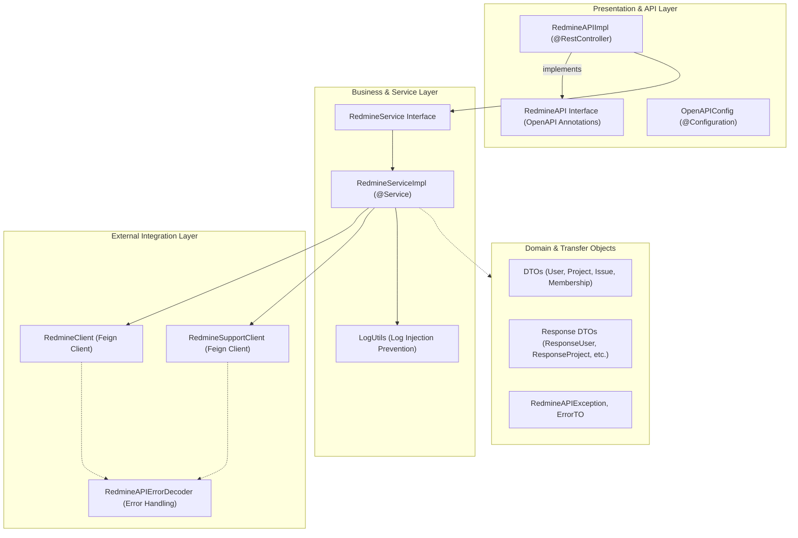
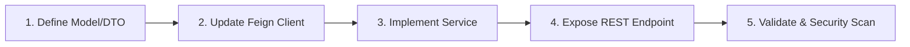

# Development Guidelines and Contribution Standards: `PICC-PC-Redmine-Integration`

This document defines the architectural standards, development workflows, coding conventions, and security requirements for contributors to **`PICC-PC-Redmine-Integration`**.

---

## Table of Contents

1. [Architecture & Design Principles](#1-architecture--design-principles)
2. [Development Environment Setup](#2-development-environment-setup)
3. [Package Structure & Code Navigation](#3-package-structure--code-navigation)
4. [Coding Standards & Best Practices](#4-coding-standards--best-practices)
   - [Spring Cloud OpenFeign Conventions](#spring-cloud-openfeign-conventions)
   - [Exception Handling & Error Decoding](#exception-handling--error-decoding)
   - [Logging & Sensitive Data Masking (CWE-117)](#logging--sensitive-data-masking-cwe-117)
   - [OpenAPI / Swagger Annotation Standards](#openapi--swagger-annotation-standards)
5. [Adding a New Redmine API Endpoint](#5-adding-a-new-redmine-api-endpoint)
6. [Security, Code Quality & Compliance Tooling](#6-security-code-quality--compliance-tooling)
   - [SAST: SpotBugs & FindSecBugs](#sast-spotbugs--findsecbugs)
   - [SCA: OWASP Dependency-Check](#sca-owasp-dependency-check)
   - [SBOM: CycloneDX Aggregate Generation](#sbom-cyclonedx-aggregate-generation)
   - [Checkstyle: Google Java Style](#checkstyle-google-java-style)
7. [Git Workflow & Branching Strategy](#7-git-workflow--branching-strategy)
   - [Branch Naming Conventions](#branch-naming-conventions)
   - [Conventional Commits](#conventional-commits)
8. [Pull Request (PR) Checklist](#8-pull-request-pr-checklist)
9. [Release Lifecycle & Versioning](#9-release-lifecycle--versioning)

---

## 1. Architecture & Design Principles

`PICC-PC-Redmine-Integration` follows clean architecture and domain-driven design principles for integration microservices:

1. **Declarative Integration**: All outbound HTTP communication with Redmine REST APIs is encapsulated in declarative **Spring Cloud OpenFeign** clients (`RedmineClient`, `RedmineSupportClient`). No manual `RestTemplate` or `HttpClient` plumbing should be used.
2. **Resilient Error Translation**: Upstream HTTP status codes and error payloads from Redmine must be decoded via `RedmineAPIErrorDecoder` into explicit Java exception types (`RedmineAPIException`) with actionable error messages.
3. **Log Sanitization & Zero-Trust Inputs**: To prevent Log Injection / Log Forging (CWE-117), all external or untrusted data written to logs must be sanitized through `LogUtils.sanitizeForLog(...)`.
4. **Separation of Concerns**: Controllers only handle HTTP mapping and validation. Service classes handle business orchestration and integration with upstream Redmine instances.

---

## 2. Development Environment Setup

### Required Tools
- **JDK 21** (Eclipse Temurin 21 or OpenJDK 21 LTS).
- **Maven 3.9+** (or use included `./mvnw` / `mvnw.cmd`).
- **IDE**: IntelliJ IDEA, VS Code, or Eclipse with:
  - **Lombok Plugin** installed and *Annotation Processing* enabled.
  - **Google Java Format** plugin recommended.

### Code Formatting and Style
- **Checkstyle**: Google Java Style conventions (`google_checks.xml`).
- **Indentation**: 4 spaces for Java, 2 spaces for XML/YAML.
- **Naming Conventions**:
  - Class names: `UpperCamelCase` (e.g., `RedmineServiceImpl`)
  - Method and variable names: `lowerCamelCase` (e.g., `createRootProject`)
  - Constants: `UPPER_SNAKE_CASE` (e.g., `DEFAULT_ROLE_ID`)
  - REST endpoints: `camelCase` or `kebab-case` under `/api/*`

---

## 3. Package Structure & Code Navigation



### Package Organization

```
com.nnp.redmineintegration/
├── RedmineIntegrationApplication.java      # Application entrypoint
├── config/
│   └── OpenAPIConfig.java                  # OpenAPI 3 and Swagger UI bean configuration
├── api/
│   ├── RedmineAPI.java                     # REST API contract with OpenAPI annotations
│   ├── impl/
│   │   └── RedmineAPIImpl.java             # REST controller implementation
│   ├── client/
│   │   ├── RedmineClient.java              # Main Redmine Feign client
│   │   └── RedmineSupportClient.java       # Support Redmine Feign client
│   ├── exception/
│   │   ├── APIErrorCode.java               # Standardized error codes
│   │   ├── ErrorTO.java                    # Error transfer object
│   │   ├── RedmineAPIErrorDecoder.java     # Feign custom error decoder
│   │   ├── RedmineAPIException.java        # Core checked exception
│   │   ├── RedmineAPIExceptionHandler.java # Global REST exception handler
│   │   └── RedmineErrorTO.java             # Upstream Redmine error parser
│   └── model/
│       ├── Issue.java                      # Issue DTO
│       ├── Membership.java                 # Membership DTO
│       ├── OnboardUser.java                # Onboarding payload DTO
│       ├── Project.java                    # Project DTO
│       ├── RootProject.java                # Root project DTO
│       ├── User.java                       # User DTO
│       └── response/                       # Response model definitions
├── service/
│   ├── RedmineService.java                 # Service contract
│   └── impl/
│       └── RedmineServiceImpl.java         # Business logic implementation
└── utils/
    └── LogUtils.java                       # Log sanitization and utility functions
```

---

## 4. Coding Standards & Best Practices

### Spring Cloud OpenFeign Conventions
- Outbound requests to Redmine endpoints are declared as Spring Cloud OpenFeign interfaces.
- Specify exact headers (`X-Redmine-API-Key`) and MIME types (`application/json`).
- Ensure Feign clients configure `RedmineAPIErrorDecoder` for graceful error propagation.

### Exception Handling & Error Decoding
- Wrap upstream exceptions into `RedmineAPIException`.
- Return structured `ErrorTO` bodies through `RedmineAPIExceptionHandler`.
- Never expose raw stack traces to client responses.

### Logging & Sensitive Data Masking (CWE-117)
To prevent Log Injection / Log Forging (CWE-117), all external parameters, user input, and HTTP error messages must be sanitized before writing to logs:

```java
// Compliant logging
log.info("Deleting project with id: {} in Redmine", LogUtils.sanitizeForLog(id));

// Non-compliant
// log.info("Deleting project with id: " + id);
```

### OpenAPI / Swagger Annotation Standards
Every endpoint in `RedmineAPI.java` must include:
1. `@Operation(summary = "...", description = "...")`
2. `@ApiResponses` documenting return codes (`200`/`201`, `400`, `404`, `500`).
3. `@Parameter` annotations describing all query/path variables.
4. `@RequestBody` annotations describing input payloads.

---

## 5. Adding a New Redmine API Endpoint

Follow this 5-step workflow:



1. **Create Request / Response DTOs**: Under `api/model` using Lombok `@Data`.
2. **Add Feign Client Method**: Under `api/client/RedmineClient.java`.
3. **Add Service Method**: Under `service/RedmineService.java` and `service/impl/RedmineServiceImpl.java` using `LogUtils.sanitizeForLog(...)`.
4. **Expose REST Endpoint**: In `api/RedmineAPI.java` and implement in `api/impl/RedmineAPIImpl.java` with complete OpenAPI annotations.
5. **Verify Build**: Run `./mvnw clean compile` and `./mvnw spotbugs:check`.

---

## 6. Security, Code Quality & Compliance Tooling

This project enforces automated security and compliance gates inherited from `PICC-PC-Abstract-NNP-Platform`:

### SAST: SpotBugs & FindSecBugs
Static Analysis Security Testing is executed with maximum effort:
```bash
./mvnw spotbugs:check
```
*Note: Suppressions for intentional patterns are maintained in [spotbugs-exclude.xml](spotbugs-exclude.xml).*

### SCA: OWASP Dependency-Check
Scans dependencies against the National Vulnerability Database (NVD):
```bash
./mvnw dependency-check:check
```
*The build fails on vulnerabilities with CVSS >= 7.0.*

### SBOM: CycloneDX Aggregate Generation
Generates a CNCF-compliant Software Bill of Materials:
```bash
./mvnw cyclonedx:makeAggregateBom
```

### Checkstyle: Google Java Style
```bash
./mvnw checkstyle:check
```

---

## 7. Git Workflow & Branching Strategy

We follow the standard GitHub Flow model:

```
main (production releases)
  ^
  | Pull Request
feature/* | fix/* | sec/* | chore/* (development branches)
```

### Branch Naming Conventions
- `feature/<description>`: New functional capabilities (e.g., `feature/custom-field-filter`)
- `fix/<issue>`: Bug fixes (e.g., `fix/user-exists-check`)
- `sec/<cve-or-issue>`: Security updates (e.g., `sec/patch-dependency-cve`)
- `chore/<task>`: Build, CI/CD, or documentation updates (e.g., `chore/update-readme`)

### Conventional Commits
Format: `<type>(<scope>): <short summary>`

Types:
- `feat`: A new feature or endpoint.
- `fix`: A bug fix.
- `docs`: Documentation changes only.
- `refactor`: Code change that neither fixes a bug nor adds a feature.
- `sec`: Security patch or CVE remediation.
- `test`: Adding or correcting tests.
- `chore`: Build tools, dependencies, or configuration changes.

---

## 8. Pull Request (PR) Checklist

Before submitting a Pull Request, verify the following:

- [ ] **Build Validation**: `./mvnw clean package` compiles cleanly.
- [ ] **SAST Verification**: `./mvnw spotbugs:check` passes without findings.
- [ ] **Vulnerability Free**: `./mvnw dependency-check:check` shows zero CVSS >= 7.0 issues.
- [ ] **No Secrets**: No hardcoded API tokens, credentials, or private URLs in code or commits.
- [ ] **Documentation**: Updated `README.md` or `USER_MANUAL_AND_DEPLOYMENT_GUIDE.md` if APIs or properties changed.
- [ ] **Commit Messages**: Follow Conventional Commits format.

---

## 9. Release Lifecycle & Versioning

This project adheres to [Semantic Versioning 2.0.0](https://semver.org/):

- **`MAJOR` (e.g., 1.0.0)**: Incompatible API breaks, Java or Spring Boot major version migrations.
- **`MINOR` (e.g., 0.1.0)**: Backwards-compatible new features or new Feign endpoints.
- **`PATCH` (e.g., 0.0.2)**: Backwards-compatible bug fixes and security patches.

To release a new version:
1. Update `<version>` in `pom.xml`.
2. Commit and tag:
   ```bash
   git commit -am "chore(release): bump version to 0.1.0"
   git tag -a v0.1.0 -m "Release version 0.1.0"
   git push origin v0.1.0
   ```
