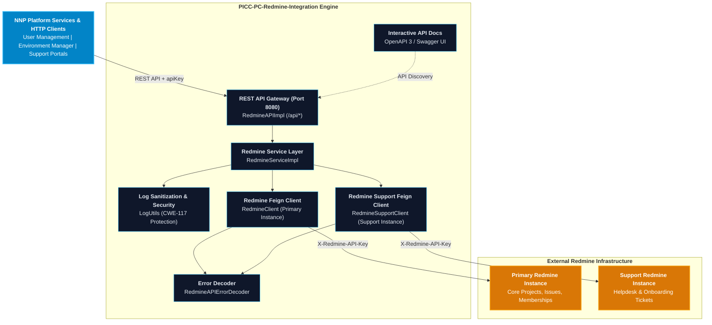

# PICC-PC-Redmine-Integration

[](https://openjdk.org/projects/jdk/21/)
[](https://spring.io/projects/spring-boot)
[](https://spring.io/projects/spring-cloud)
[](LICENSE)
[]()

Enterprise Redmine REST API integration microservice establishing standard user provisioning, project lifecycle automation, role and membership governance, issue tracking, and metadata discovery across the **Platform Infrastructure and Core Components (PICC)** suite of the **Nubo Native Platform (NNP)**.

---

## Table of Contents

- [Overview](#overview)
- [Key Architectural Features](#key-architectural-features)
- [Architecture and Ecosystem](#architecture-and-ecosystem)
- [Technology Matrix](#technology-matrix)
- [Quick Start](#quick-start)
  - [Prerequisites](#prerequisites)
  - [Configuration](#configuration)
  - [Local Execution](#local-execution)
  - [Docker Container Execution](#docker-container-execution)
  - [Full Stack with Docker Compose](#full-stack-with-docker-compose)
- [REST API Capabilities](#rest-api-capabilities)
- [Project Documentation](#project-documentation)
- [Repository Structure](#repository-structure)
- [Security and Vulnerability Management](#security-and-vulnerability-management)
- [Contributing](#contributing)
- [License](#license)

---

## Overview

**`PICC-PC-Redmine-Integration`** provides a declarative, resilient integration gateway between internal platform microservices and external **Redmine REST APIs**. It automates identity lifecycle management, multi-tenant project initialization, role assignments, issue tracking, and metadata synchronization.

Inheriting from the platform's standardized BOM ([`PICC-PC-Abstract-NNP-Platform`](https://github.com/Nubo-Native-Platform/PICC-PC-Abstract-NNP-Platform)), `PICC-PC-Redmine-Integration` enforces Java 21 LTS runtime standards, Spring Cloud OpenFeign client patterns, and automated DevSecOps compliance scanning.

---

## Key Architectural Features

- **Declarative REST Integration**: Powered by **Spring Cloud OpenFeign** with dedicated `X-Redmine-API-Key` headers and custom `RedmineAPIErrorDecoder` exception translation.
- **Identity & Access Governance**: Automated user provisioning, existence verification, user detail retrieval, and credential configuration.
- **Project Lifecycle Automation**: Programmatic provisioning of standard and root projects, validation of project identifiers, and custom field mapping.
- **Role & Membership Management**: Association of users with projects using granular Redmine role IDs (Manager, Developer, Reporter, DevOps-Architect, Tech Lead, DevOps-Engineer).
- **Issue & Ticket Tracking**: Creation, updates, detailed queries, and filtering of Redmine issues for engineering and support workflows.
- **Automated User Onboarding**: Orchestrated single-call transaction that provisions users, verifies or creates projects, and assigns default project roles.
- **Metadata & Enumeration Discovery**: Direct discovery endpoints for issue categories, trackers, statuses, and issue priorities.
- **Interactive OpenAPI 3 / Swagger Documentation**: Built-in API documentation and interactive console via Swagger UI.
- **DevSecOps Security Pipeline**:
  - **SAST**: SpotBugs + FindSecBugs security rules (`spotbugs-exclude.xml`).
  - **SCA**: OWASP Dependency-Check enforcing zero CVSS >= 7.0 vulnerabilities.
  - **SBOM**: CycloneDX plugin generating immutable Software Bill of Materials (`bom.json`).
  - **Log Sanitization**: Strict CWE-117 log forging protection using `LogUtils.sanitizeForLog(...)`.

---

## Architecture and Ecosystem



---

## Technology Matrix

| Category | Component / Library | Version | Role / Description |
| :--- | :--- | :--- | :--- |
| **Runtime** | Java OpenJDK | `21` (LTS) | Long-Term Support Java runtime environment |
| **Parent BOM** | `abstract-nnp` | `1.0.0` | Standardized enterprise parent and dependency governance |
| **Framework** | `spring-boot-starter-web` | `3.5.4` | Enterprise microservice application framework |
| **Cloud / RPC** | `spring-cloud-starter-openfeign` | `2025.0.0` | Declarative HTTP client for Redmine REST API |
| **Logging** | `spring-boot-starter-log4j2` | Managed | High-throughput structured logging |
| **Object Mapping** | `modelmapper` / `json` | Managed | DTO transformation and JSON payload handling |
| **API Docs** | `springdoc-openapi-starter-webmvc-ui` | Managed | OpenAPI 3.0 specification & Swagger UI console |
| **SAST** | `spotbugs-maven-plugin` + `findsecbugs` | `4.8.6.0` / `1.13.0` | Static application security testing |
| **SCA** | `dependency-check-maven` | `10.0.4` | Software composition analysis and CVE scanning |
| **SBOM** | `cyclonedx-maven-plugin` | `2.9.1` | Software Bill of Materials (SBOM) generation |
| **Code Quality** | `maven-checkstyle-plugin` | `3.5.0` | Google Java Style compliance verification |

---

## Quick Start

### Prerequisites
- **JDK 21** (Eclipse Temurin 21 or OpenJDK 21 LTS).
- **Maven 3.9+** (or use included `./mvnw` wrapper).
- Network access to a running **Redmine instance (5.0+)** with the REST web service enabled.

### Configuration
Configure your Redmine instance credentials in `src/main/resources/application.properties` or via environment variables:

```properties
# Server Configuration
server.port=8080
spring.application.name=redmine-integration

# Primary Redmine Feign Client Configuration
feign.name=redmine-client
feign.url=http://localhost:3000

# Support Redmine Feign Client Configuration
feign.support.name=redmine-support-client
feign.support.url=http://localhost:3000

# Default Membership Role ID (4 = Developer)
redmine.role=4
```

### Local Execution

```bash
# Clone the repository
git clone https://github.com/Nubo-Native-Platform/PICC-PC-Redmine-Integration.git
cd PICC-PC-Redmine-Integration

# Validate POM structure
./mvnw validate

# Compile and package application
./mvnw clean package -DskipTests

# Run locally with Spring Boot
./mvnw spring-boot:run
```

Once running, explore the interactive documentation:
- **Swagger UI**: `http://localhost:8080/swagger-ui.html`
- **OpenAPI 3 JSON Specification**: `http://localhost:8080/v3/api-docs`

### Docker Container Execution

```bash
# Build Docker image
docker build -t picc-pc-redmine-integration:latest .

# Run container with environment overrides
docker run -d -p 8080:8080 \
  -e FEIGN_URL=http://redmine.example.com:3000 \
  -e REDMINE_ROLE=4 \
  --name redmine-integration picc-pc-redmine-integration:latest
```

### Full Stack with Docker Compose

To spin up a full local testbed including PostgreSQL, Primary Redmine, Support Redmine, and the integration microservice:

```bash
# Prepare environment file
cp .env.example .env

# Build and start all services
docker compose up --build -d

# Check running services
docker compose ps
```

---

## REST API Capabilities

| HTTP Method | Path | Summary | Authentication |
| :--- | :--- | :--- | :--- |
| `POST` | `/api/createUser` | Create new Redmine user account | `apiKey` (Query param) |
| `GET` | `/api/getUsers` | Get map of username to user ID | `apiKey` (Query param) |
| `GET` | `/api/checkLoginExists` | Check if username exists | `apiKey` (Query param) |
| `GET` | `/api/getProjects` | List all accessible projects | `apiKey` (Query param) |
| `GET` | `/api/checkProjectExists` | Check if project exists | `apiKey` (Query param) |
| `GET` | `/api/getAPIKey` | Get API access key for a user ID | `apiKey` (Query param) |
| `DELETE` | `/api/deleteUser` | Delete user by ID | `apiKey` (Query param) |
| `POST` | `/api/createProject` | Create standard project | `apiKey` (Query param) |
| `DELETE` | `/api/deleteProject` | Delete project by ID or identifier | `apiKey` (Query param) |
| `POST` | `/api/{projectId}/associateUser` | Assign user membership to project | `apiKey` (Query param) |
| `GET` | `/api/getUserDetail` | Retrieve user profile details | `apiKey` (Query param) |
| `POST` | `/api/onboarduser` | Orchestrated user & project onboarding | `apiKey` (Query param) |
| `POST` | `/api/createIssue` | Create issue in project | `apiKey` (Query param) |
| `POST` | `/api/createSupportIssue` | Create support issue for onboarding | `apiKey` (Query param) |
| `GET` | `/api/getIssues` | Filter issues by project, author, tracker | `apiKey` (Query param) |
| `PUT` | `/api/updateIssue` | Update issue attributes or comments | `apiKey` (Query param) |
| `GET` | `/api/getIssuesDetails` | Get full details of an issue | `apiKey` (Query param) |
| `POST` | `/api/createRootProject` | Provision root project and admin user | `apiKey` (Query param) |
| `GET` | `/api/getMembershipsForProj/{projId}` | Get list of memberships for project | `apiKey` (Query param) |
| `GET` | `/api/issue-categories` | Get issue categories for project | `apiKey` (Query param) |
| `GET` | `/api/trackers` | List all issue trackers | `apiKey` (Query param) |
| `GET` | `/api/issue-statuses` | List all workflow issue statuses | `apiKey` (Query param) |
| `GET` | `/api/issue-priorities` | List all issue priorities | `apiKey` (Query param) |

---

## Project Documentation

Comprehensive documentation is provided across the repository:

- **[User Manual and Deployment Guide](USER_MANUAL_AND_DEPLOYMENT_GUIDE.md)**: End-to-end user manual, API payloads, curl samples, containerization, and Kubernetes production deployment.
- **[Development Guidelines and Contribution Standards](DEVELOPMENT_GUIDELINES.md)**: Coding conventions, OpenFeign standards, CWE-117 log sanitization, adding new endpoints, and PR checklists.
- **[Contributing Guide](CONTRIBUTING.md)**: Open-source contribution workflows and branch rules.
- **[Maintainers Registry](MAINTAINERS.md)**: Core maintainers and project leadership.
- **[Security Policy](SECURITY.md)**: Vulnerability disclosure workflow and reporting guidelines.
- **[Code of Conduct](CODE_OF_CONDUCT.md)**: Community participation guidelines.

---

## Repository Structure

```
PICC-PC-Redmine-Integration/
├── .github/
│   ├── ISSUE_TEMPLATE/                     # Bug report & feature request templates
│   ├── workflows/
│   │   └── ci-cd.yml                       # GitHub Actions CI/CD automation
│   └── pull_request_template.md            # Standard PR checklist and template
├── .mvn/
│   └── wrapper/                            # Maven Wrapper binaries & properties
├── docker/
│   └── db/                                 # Database initialization scripts for compose
├── src/
│   ├── main/
│   │   ├── java/com/nnp/redmineintegration/
│   │   │   ├── api/
│   │   │   │   ├── client/                 # OpenFeign HTTP Clients (Redmine REST API)
│   │   │   │   ├── exception/              # API Error Codes, ErrorDecoder, and Exceptions
│   │   │   │   ├── impl/                   # REST API Controller Implementation
│   │   │   │   ├── model/                  # Request & Response DTO Models
│   │   │   │   └── RedmineAPI.java         # REST API Interface with OpenAPI Annotations
│   │   │   ├── config/                     # OpenAPI 3 / Swagger UI Configuration
│   │   │   ├── service/                    # Business Logic Interface & Implementation
│   │   │   ├── utils/                      # LogUtils (CWE-117 Log Sanitization)
│   │   │   └── RedmineIntegrationApplication.java # Main Application Entrypoint
│   │   └── resources/
│   │       ├── application.properties      # Base Application Configuration
│   │       └── application-example.properties # Template Environment Configuration
│   └── test/                               # Unit & Integration Tests
├── .env.example                            # Environment Variables Template
├── .gitignore                              # Git Ignore Configuration
├── Dockerfile                              # Production Runtime Container Definition
├── docker-compose.yml                      # Full-stack Local Development Environment
├── pom.xml                                 # Maven POM (Inheriting abstract-nnp parent)
├── spotbugs-exclude.xml                    # SpotBugs SAST Filter Rules
├── README.md                               # Project Landing Page & Quick Start
├── USER_MANUAL_AND_DEPLOYMENT_GUIDE.md     # Comprehensive User & Deployment Manual
├── DEVELOPMENT_GUIDELINES.md               # Developer Guidelines & Contribution Standards
├── CONTRIBUTING.md                         # Open source contribution workflow
├── MAINTAINERS.md                          # Project maintainers and governance
├── CODE_OF_CONDUCT.md                      # Community code of conduct
├── SECURITY.md                             # Vulnerability reporting and policy
└── LICENSE                                 # Apache 2.0 Open Source License
```

---

## Security and Vulnerability Management

This project maintains a zero-tolerance policy for critical CVEs and enforces strict log injection protection (CWE-117). To report security issues, please refer to [SECURITY.md](SECURITY.md) or contact **contribution@nubons.com**.

---

## Contributing

Contributions are welcome under the Apache 2.0 License. Please review [CONTRIBUTING.md](CONTRIBUTING.md) and [DEVELOPMENT_GUIDELINES.md](DEVELOPMENT_GUIDELINES.md) prior to submitting pull requests.

---

## License

This project is licensed under the [Apache License, Version 2.0](LICENSE).
