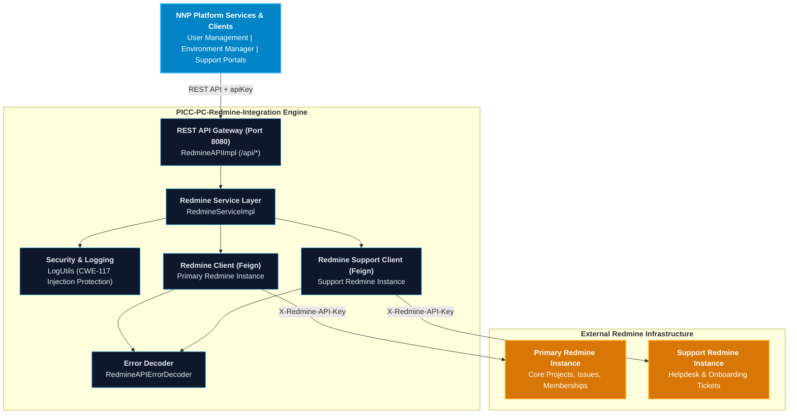
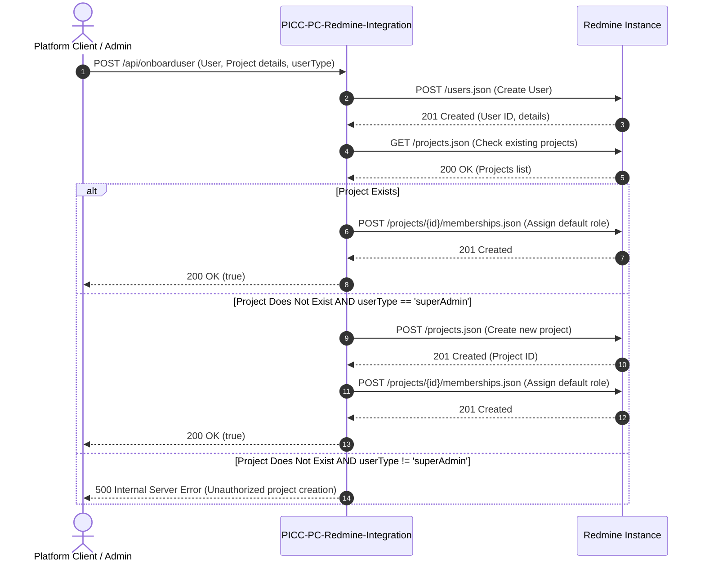
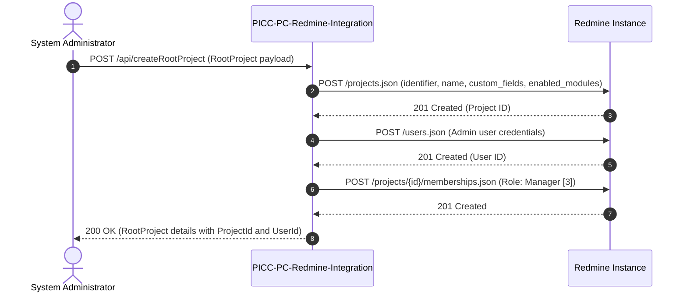
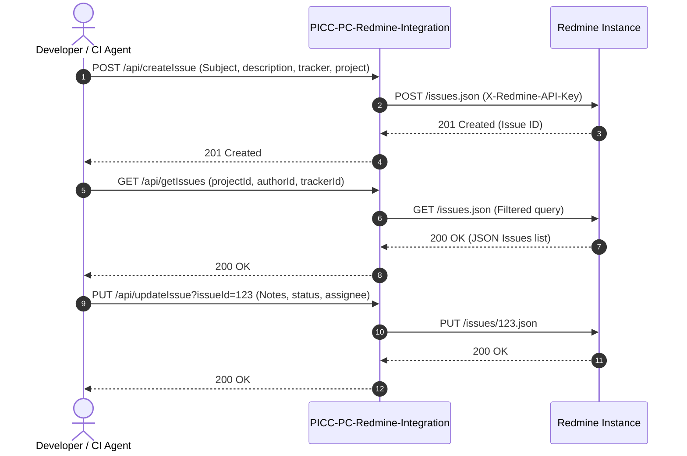

# User Manual and Deployment Guide: `PICC-PC-Redmine-Integration`

This document provides a comprehensive operational and deployment manual for the **`PICC-PC-Redmine-Integration`** microservice within the **Nubo Native Platform (NNP)**. It covers configuration, operational workflows, containerization, local orchestration with Docker Compose, production deployment on Kubernetes, and troubleshooting.

---

## Table of Contents

1. [Service Architecture & Role](#1-service-architecture--role)
2. [Prerequisites & System Requirements](#2-prerequisites--system-requirements)
3. [Configuration Reference & Profiles](#3-configuration-reference--profiles)
   - [Application Properties Matrix](#application-properties-matrix)
   - [Configuration Profiles](#configuration-profiles)
   - [Centralized Config Server Integration](#centralized-config-server-integration)
4. [Functional Operations & Service Workflows](#4-functional-operations--service-workflows)
   - [User Onboarding Sequence](#user-onboarding-sequence)
   - [Root Project Provisioning](#root-project-provisioning)
   - [Issue Lifecycle Workflow](#issue-lifecycle-workflow)
   - [Redmine Roles & Permission Structure](#redmine-roles--permission-structure)
   - [REST API Endpoints Reference](#rest-api-endpoints-reference)
5. [Local Build & Containerization](#5-local-build--containerization)
   - [Local Build with Maven](#local-build-with-maven)
   - [Docker Container Build & Execution](#docker-container-build--execution)
   - [Full Stack with Docker Compose](#full-stack-with-docker-compose)
6. [Production Deployment & CI/CD](#6-production-deployment--cicd)
   - [Kubernetes Deployment Reference](#kubernetes-deployment-reference)
   - [Automated Deployment Pipelines](#automated-deployment-pipelines)
7. [Troubleshooting & Frequently Asked Questions](#7-troubleshooting--frequently-asked-questions)

---

## 1. Service Architecture & Role

`PICC-PC-Redmine-Integration` functions as the integration gateway between internal platform services and **Redmine REST APIs**. It abstracts user provisioning, multi-tenant project governance, role-based project memberships, ticket lifecycle management, and metadata discovery.



---

## 2. Prerequisites & System Requirements

### System Requirements
| Component | Minimum Specification | Recommended Specification |
| :--- | :--- | :--- |
| **JDK Runtime** | OpenJDK 21 LTS / Eclipse Temurin 21 | Eclipse Temurin 21 (Containerized) |
| **CPU** | 1 Core (vCPU) | 2 Cores |
| **Memory (RAM)** | 512 MB | 1024 MB |
| **Build Tool** | Apache Maven 3.9+ | Included Maven Wrapper (`./mvnw`) |
| **Container Engine**| Docker 24.0+ / Podman | Docker Engine + Docker Compose v2 |

### Upstream Redmine Prerequisites
1. **Redmine Version**: 5.0+ (Tested against Redmine 5.1).
2. **REST API Enabled**: In Redmine, navigate to **Administration -> Settings -> API** and check **Enable REST web service**.
3. **API Key Generation**: Generate an administrative API key via **My Account -> API access key** (or create dedicated service accounts).

---

## 3. Configuration Reference & Profiles

### Application Properties Matrix

| Property Key | Default Value | Environment Override | Description |
| :--- | :--- | :--- | :--- |
| `server.port` | `8080` | `SERVER_PORT` | HTTP port on which the service listens |
| `spring.profiles.active` | `main` | `SPRING_PROFILES_ACTIVE` | Active Spring profile (`local`, `main`, `dev`) |
| `feign.name` | `redmine-client` | `FEIGN_NAME` | Primary Feign client identifier |
| `feign.url` | `http://localhost:3000`| `FEIGN_URL` | Base URL of primary Redmine instance |
| `feign.support.name` | `redmine-support-client` | `FEIGN_SUPPORT_NAME` | Support Feign client identifier |
| `feign.support.url` | `http://localhost:3000`| `FEIGN_SUPPORT_URL` | Base URL of support Redmine instance |
| `redmine.role` | `4` | `REDMINE_ROLE` | Default role ID assigned during project association |
| `spring.config.import` | optional configserver | `CONFIG_SERVER_URL` | Centralized Spring Cloud Config Server URL |

### Configuration Profiles

1. **`application.properties`**: Default base configuration loaded when packaged.
2. **`local`**: Configured for local workstation development against standalone Redmine.
3. **`main`**: Configured for Kubernetes / staging / production deployments connecting via internal service mesh or cluster DNS.

---

## 4. Functional Operations & Service Workflows

### User Onboarding Sequence

The onboarding process coordinates user provisioning, project discovery or creation, and role-based access assignment in a unified transaction.



---

### Root Project Provisioning

Provisions a top-level workspace project with administrative membership and enabled core modules.



---

### Issue Lifecycle Workflow



---

### Redmine Roles & Permission Structure

When associating users to projects via `/api/{projectId}/associateUser` or during onboarding, Redmine role IDs map as follows:

| Role ID | Role Name | Intended Usage |
| :--- | :--- | :--- |
| `1` | Non member | Default non-member permissions |
| `2` | Anonymous | Public unauthenticated access |
| `3` | Manager | Full project admin, member assignment, repository configuration |
| `4` | Developer | Issue creation, code commits, branch creation, board movements |
| `5` | Reporter | Read-only issue viewing and bug reporting |
| `6` | DevOps-Architect | Pipeline configuration, release tags, environment deployment |
| `7` | Tech Lead | Code review approval, milestone management, priority assignment |
| `8` | DevOps-Engineer | Infrastructure issue tracking, deployment log access |

---

### REST API Endpoints Reference

All endpoints accept authentication via the `apiKey` query parameter.

#### User Provisioning (`POST /api/createUser`)
```bash
curl -X POST "http://localhost:8080/api/createUser?apiKey=YOUR_REDMINE_ADMIN_KEY" \
  -H "Content-Type: application/json" \
  -d '{
    "user": {
      "login": "john.doe",
      "firstname": "John",
      "lastname": "Doe",
      "mail": "john.doe@example.com",
      "password": "SecurePassword123!"
    }
  }'
```

#### User Onboarding (`POST /api/onboarduser`)
```bash
curl -X POST "http://localhost:8080/api/onboarduser?apiKey=YOUR_REDMINE_ADMIN_KEY" \
  -H "Content-Type: application/json" \
  -d '{
    "login": "jane.smith",
    "firstname": "Jane",
    "lastname": "Smith",
    "mail": "jane.smith@example.com",
    "password": "TemporaryPassword123!",
    "projectName": "Payment Gateway Core",
    "identifier": "payment-gateway-core",
    "userType": "superAdmin"
  }'
```

#### Create Root Project (`POST /api/createRootProject`)
```bash
curl -X POST "http://localhost:8080/api/createRootProject?apiKey=YOUR_REDMINE_ADMIN_KEY" \
  -H "Content-Type: application/json" \
  -d '{
    "name": "Platform Infrastructure",
    "identifier": "platform-infra",
    "description": "Root project for core platform services",
    "login": "infra.admin",
    "firstname": "Infra",
    "lastname": "Admin",
    "mail": "infra.admin@example.com",
    "password": "AdminSecurePassword123!"
  }'
```

#### Query Metadata Enumerations
| Operation | Method | Endpoint | Description |
| :--- | :--- | :--- | :--- |
| **Trackers** | `GET` | `/api/trackers?apiKey={key}` | Lists Bug, Feature, Support trackers |
| **Issue Statuses** | `GET` | `/api/issue-statuses?apiKey={key}` | Lists New, In Progress, Resolved, Closed |
| **Priorities** | `GET` | `/api/issue-priorities?apiKey={key}` | Lists Low, Normal, High, Urgent |
| **Categories** | `GET` | `/api/issue-categories?projectId={id}&apiKey={key}` | Lists categories for specific project |

---

## 5. Local Build & Containerization

### Local Build with Maven

```bash
# Clean, compile and validate POM
./mvnw clean compile

# Run unit tests
./mvnw test

# Package into executable JAR
./mvnw clean package -DskipTests
```

### Docker Container Build & Execution

```bash
# Build Docker image
docker build -t picc-pc-redmine-integration:latest .

# Run Docker container locally
docker run -d \
  --name redmine-integration \
  -p 8080:8080 \
  -e "SPRING_PROFILES_ACTIVE=main" \
  -e "FEIGN_URL=http://redmine.example.com:3000" \
  picc-pc-redmine-integration:latest
```

### Full Stack with Docker Compose

A complete local development stack including PostgreSQL, Primary Redmine, Support Redmine, and the integration service is provided:

```bash
# 1. Prepare environment
cp .env.example .env

# 2. Build and launch all services
docker compose up --build -d

# 3. View service status
docker compose ps
```

---

## 6. Production Deployment & CI/CD

### Kubernetes Deployment Reference

```yaml
apiVersion: apps/v1
kind: Deployment
metadata:
  name: picc-pc-redmine-integration
  namespace: nnp-picc
  labels:
    app.kubernetes.io/name: picc-pc-redmine-integration
    app.kubernetes.io/part-of: nubo-native-platform
spec:
  replicas: 2
  selector:
    matchLabels:
      app.kubernetes.io/name: picc-pc-redmine-integration
  template:
    metadata:
      labels:
        app.kubernetes.io/name: picc-pc-redmine-integration
    spec:
      containers:
      - name: redmine-integration
        image: picc-pc-redmine-integration:latest 
        imagePullPolicy: IfNotPresent
        ports:
        - containerPort: 8080
          name: http
        env:
        - name: SPRING_PROFILES_ACTIVE
          value: "main"
        - name: FEIGN_URL
          valueFrom:
            configMapKeyRef:
              name: redmine-config
              key: primary-url
        - name: FEIGN_SUPPORT_URL
          valueFrom:
            configMapKeyRef:
              name: redmine-config
              key: support-url
        resources:
          requests:
            memory: "256Mi"
            cpu: "100m"
          limits:
            memory: "1024Mi"
            cpu: "1000m"
        readinessProbe:
          httpGet:
            path: /v3/api-docs
            port: 8080
          initialDelaySeconds: 20
          periodSeconds: 10
        livenessProbe:
          httpGet:
            path: /v3/api-docs
            port: 8080
          initialDelaySeconds: 30
          periodSeconds: 15
```

### Automated Deployment Pipelines

The repository includes GitHub Actions automation (`.github/workflows/ci-cd.yml`) that validates the build, executes static code analysis (SpotBugs), performs CVE vulnerability scanning (OWASP Dependency Check), generates SBOM (CycloneDX), and publishes release packages to GitHub Packages.

---

## 7. Troubleshooting & Frequently Asked Questions

| Issue | Potential Cause | Resolution |
| :--- | :--- | :--- |
| `401 Unauthorized` on Redmine calls | Invalid or missing `apiKey` | Verify that the passed `apiKey` has administrative privileges in Redmine (`Administration -> Settings -> API -> Enable REST web service`). |
| `404 Not Found` when creating membership | User or Project ID does not exist | Ensure user creation succeeded and returned a valid numeric ID before invoking membership association. |
| `500 Internal Server Error` during project creation | Project identifier already in use or contains invalid characters | Use alphanumeric characters and dashes only; special characters are stripped automatically by the service. |
| Connection Refused to Config Server | Network unreachable or config service down | Verify URL in `application.properties` or pass `CONFIG_SERVER_URL` via environment variables. |
| `RedmineAPIException: 422 Unprocessable Entity` | Mandatory Redmine custom field missing | Check if custom fields are marked mandatory in Redmine project schema. |
